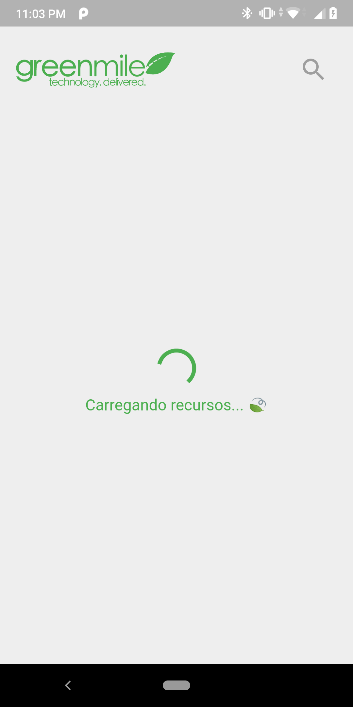
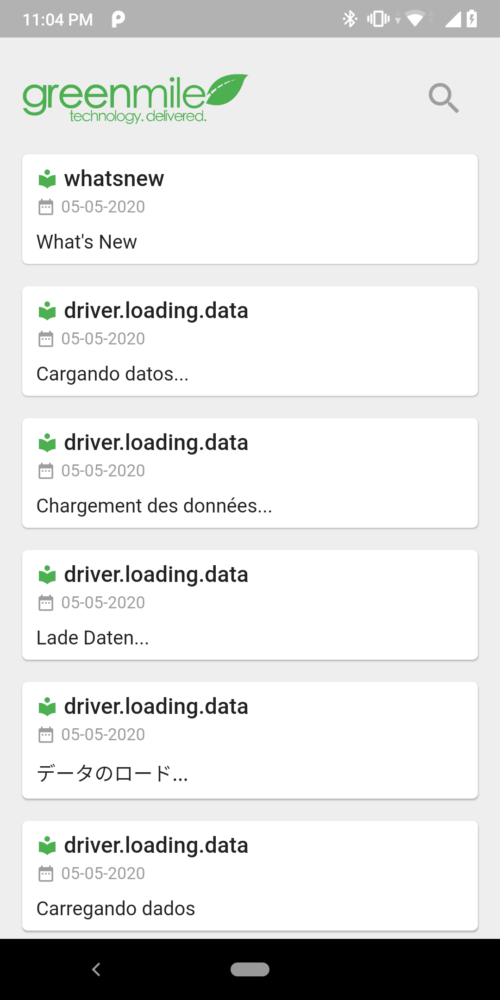
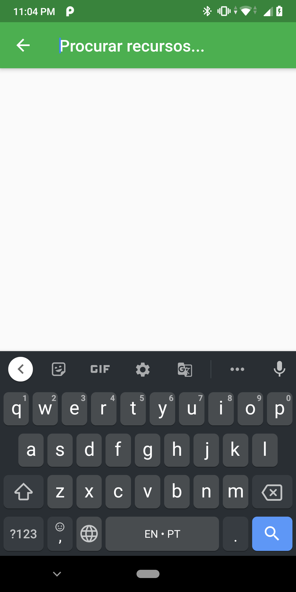
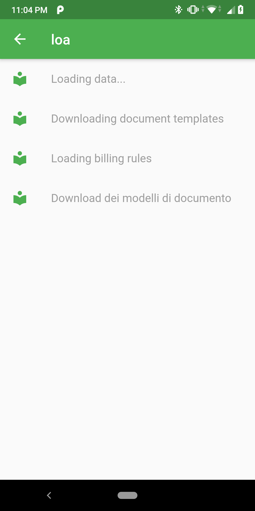

# Desafio Mobile - GreenMile

Aplicação para listagem de recursos de tradução (i18n).

|                           |                           |                           |                           |
| :-----------------------: | :-----------------------: | :-----------------------: | :-----------------------: |
|  |  |  |  |
|                           |                           |                           |                           |

## Como rodar

```
flutter packages get
flutter run
```

## Estrutura

```sh
├── lib
│   ├── blocs
│   │   ├── resource
│   │   │   ├── resource_bloc.dart
│   │   │   ├── resource_event.dart
│   │   │   └── resource_state.dart
│   │   ├── resource_observer.dart
│   │   └── resource_search
│   │       ├── resource_search_bloc.dart
│   │       ├── resource_search_event.dart
│   │       └── resource_search_state.dart
│   ├── constants.dart
│   ├── data
│   │   ├── data_providers
│   │   │   ├── local_provider.dart
│   │   │   └── remote_provider.dart
│   │   ├── models
│   │   │   ├── resource.dart
│   │   │   └── resource.g.dart
│   │   ├── repositories
│   │   │   └── resource_repository.dart
│   │   └── services
│   │       └── services_locator.dart
│   ├── main.dart
│   └── presentation
│       ├── screens
│       │   └── home_screen.dart
│       └── widgets
│           ├── bottom_loader.dart
│           ├── resource_item.dart
│           └── resource_search.dart

```

## Dependências

```sh
http: ^0.12.2
json_annotation: ^3.0.1
intl: ^0.16.1
meta: ^1.1.8
equatable: ^1.2.3
bloc: ^6.0.1
flutter_bloc: ^6.0.1
path: ^1.7.0
sqflite: ^1.3.1
get_it: ^4.0.4
flutter_svg: ^0.18.0
build_runner: ^1.10.0
json_serializable: ^3.4.0
```

## Como instalar

```sh
flutter build apk --split-per-abi
flutter install
```
